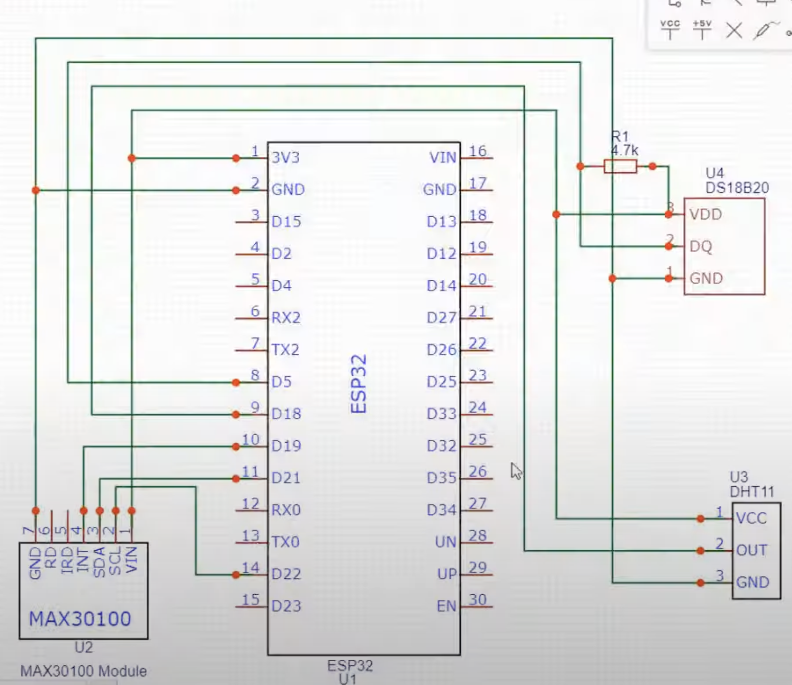
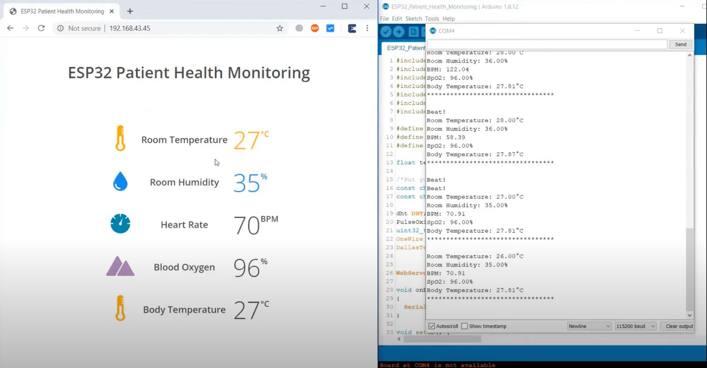

# IoT-Based Patient Health Monitoring System

## Introduction

In the rapidly evolving landscape of healthcare technology, the Internet of Things (IoT) is playing a crucial role in transforming how patient health is monitored and managed. This project introduces a smart patient health tracking system using a Web Server, enabling the monitoring of vital parameters such as heart rate, blood oxygen level, and body temperature. 

## Components

- **ESP32 Board**: 1
- **MAX30100 Pulse Oximeter Sensor**: 1
- **DS18B20 Temperature Sensor**: 1
- **DHT11 Humidity & Temperature Sensor**: 1
- **Resistor 4.7K**: 1
- **Connecting Wires**: 10
- **Breadboard**: 1

### MAX30100 Pulse Oximeter Sensor
The MAX30100 sensor integrates pulse oximetry and heart-rate monitoring solutions, combining LEDs, a photodetector, optimized optics, and low-noise analog signal processing. It operates from 1.8V to 3.3V power supplies and can be powered down through software with minimal standby current.

### DS18B20 Temperature Sensor
This pre-wired and waterproofed sensor measures temperatures ranging from -55 to 125°C (-67°F to +257°F). It offers digital precision with minimal signal degradation over long distances and employs the Dallas 1-Wire protocol.

### DHT11 Humidity & Temperature Sensor
The DHT11 is a low-cost digital sensor that measures temperature and humidity. It utilizes a capacitive humidity sensor and a thermistor to provide digital signals, requiring precise timing for data retrieval with a refresh rate of once every 2 seconds.

## Circuit Diagram

## Methodology

1. Gather the necessary components including the ESP32 development board, pulse oximeter sensor, and DHT11 temperature and humidity sensor.
2. Connect the sensors to the ESP32 development board according to the wiring diagram.
3. Write and upload the code into the ESP32 web server using the Arduino IDE. The code includes functions to read data from the sensors, display the data on a web page, and send the data to a remote server for storage and analysis.
4. Test the code on the ESP32 development board to ensure that it functions correctly and that the sensors provide accurate data.
5. Create a user-friendly web interface for the health monitoring system, featuring real-time data visualization, alerts for abnormal readings, and historical data analysis.
6. Deploy the system in a real-world setting and test it with actual users.
7. Analyze the data collected by the system to identify trends or patterns and use the information to improve the system's performance and accuracy.
8. Continuously monitor and maintain the system to ensure optimal functioning and accurate data collection.

## Implementation

The IoT-based Patient Health Monitoring system utilizes an ESP32 Web Server to interface with the sensors. The circuit diagram showcases the connection of MAX30100, DHT11, and DS18B20 with the ESP32 board. All sensors operate at 3.3V VCC and are connected appropriately to the power and ground pins of the ESP32.

## Results & Working

Upon uploading the code, the ESP32 connects to a network and displays the IP Address upon successful connection. This IP Address can be accessed via any web browser, showcasing real-time data such as room temperature, humidity, heart rate, blood oxygen level, and body temperature. The patient's health status can also be viewed on a mobile phone by accessing the provided IP Address.

## Future Scope: Sensor Network Design for Medical Institutions

We aim to enhance the system's capabilities to cater to the needs of medical institutions by developing a comprehensive sensor network design. This includes:

- **Central Node for Monitoring & Control using Local Cloud**: A central node will aggregate data from multiple sensors deployed throughout the medical institution, enabling robust data collection and analysis.
- **Integration of Diverse Sensors**: Additional sensors for monitoring blood pressure, ECG, respiratory rate, glucose levels, and more will be integrated to provide holistic health monitoring solutions.
- **Advanced Analytics and Predictive Insights**: Using machine learning algorithms, actionable insights such as early detection of abnormalities and predictive analytics for disease management will be derived.
- **Enhanced Security and Compliance**: Stringent security measures and compliance with regulatory standards like HIPAA will be implemented to safeguard patient information.
- **Scalability and Interoperability**: The system will be designed for scalability and interoperability with existing hospital management systems and medical devices.
- **User-Friendly Interface**: The central monitoring and control interface will be intuitive and customizable, empowering healthcare professionals to make informed decisions swiftly.

## Commercialization and Deployment Strategy

Our commercialization strategy involves collaboration with healthcare institutions, technology partners, and regulatory bodies to ensure seamless integration and compliance. Pilot deployments will validate the efficacy and usability of the system in real-world settings, with feedback informing iterative improvements.

## Screenshots

---

By harnessing the power of IoT technology, advanced analytics, and interoperability, this project aspires to revolutionize healthcare delivery and enhance patient outcomes globally.
